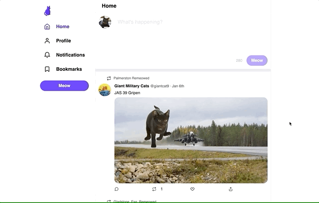

# Twitter project

This was a school project that used React, NodeJs, and Express. 

The focus was primarily front-end. An API was provided, offering some dummy data in the form of users and tweets. 

## Functionality

My application includes the following features:

### View a single tweet

When the user navigates to `/tweet/:tweetId`, they should see the details for the specified tweet. The user can simply click on any tweet and it takes them to it's own tweet page based on the ID. 

### View a "home feed"

When navigating to the root URL `/`, the user should see a list of tweets from the accounts that the current user follows.

### View a profile page

When navigating to `/users/:userHandle`, information about that user is displayed, above a list of that user's tweets (and retweets):

KEY UX FEATURES ON LIKING THE POSTS: 
- I used keyframe animations on the heart icon so that it scales up and turns red when liked. 
- The retweet button turns green. 

### Liking a tweet

When clicking the "like" button, it should increment the # of likes. Clicking again should "unlike" the tweet.

### Posting a new tweet

On the homepage, the user should be able to create a new tweet by writing in the box and clicking "Meow":

KEY UX FEATURES ON TWEET: 
- when the user tweets, the characters count goes down. It turns to red when it gets below zero. 
- The input placeholder will change if the user tries to tweet with nothing in the input
- when the user tweets, a loading icon appears in the tweet button to let the user know that the tweet is being processed. 

# Potential Stretch Goals: 

A fully-functional Twitter clone would have many other features: 

- Any other pages, like "Notifications" and "Bookmarks". I created routes for them, but they don't have any content.
- Following / unfollowing users
- The "Meow" button in the sidebar.
- Retweeting
- Replying to tweets
- The other tabs on the profile page (Media / Likes)
- Attaching media to new tweets
- The "share" / "upload" button on tweets 